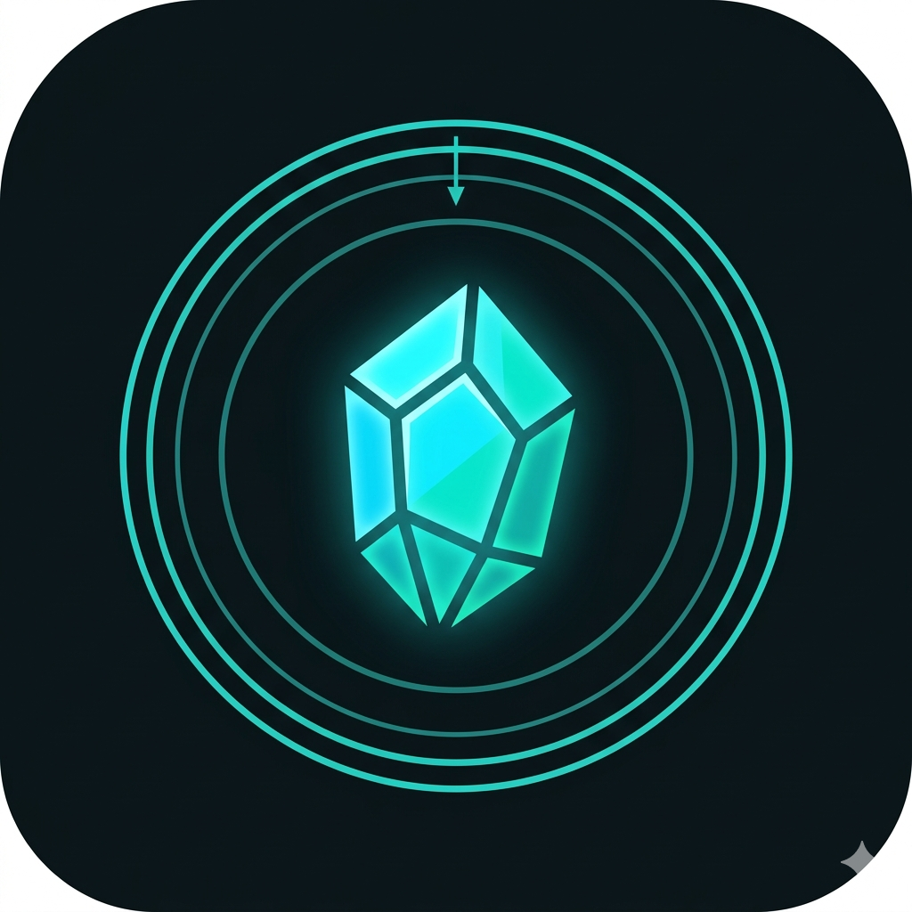

<p align="center">
  
</p>

# SC Ore Scanner

Real-time Star Citizen mining overlay. It reads the RS (Radar Signature) number off the mining scanner HUD on screen, matches it to the corresponding ore type, and shows the ore name, quantity, and market price in an always-on-top overlay.


> **v2.0.0 is an all-Rust rewrite** — one self-contained app, no Python, no setup.
> (v1 was a Python backend + Tauri frontend.)

## Download & Play

**[Download the latest release](https://github.com/Hunter-36/sc-ore-scanner/releases/latest)** — Windows 10/11.

Pick one:
- **Installer (recommended):** run `SC Ore Scanner_<version>_x64-setup.exe` (or the `.msi`).
- **Portable:** unzip `…-windows-portable.zip` and run `SC Ore Scanner.exe`. Nothing to install.

Then:
1. Launch it. The overlay appears top-right; the OCR engine warms up for ~15–20s.
2. Click **Set region**, drag a box around the mining scanner's **RS** number, and release.
3. Mine — the ore (e.g. `Beryl 3x`) and its market price appear within a couple of
   seconds of looking at a radar signature. Quit with the **✕** in the overlay.

> 💡 **Calibration tip:** leave a little margin around the RS readout so the number
> stays inside the box. Press **Esc** (or **Cancel**) to abort, and draw a box at
> least ~20 px — a smaller one is ignored. You can re-run **Set region** any time.

> ⚠️ Windows may show **"Windows protected your PC"** for this free, unsigned tool —
> click **More info → Run anyway**.

> ⚙️ **Tuning (Settings):** click the **gear** icon on the overlay for live sliders —
> scan interval, confirm frames, upscale, and contrast (CLAHE) — plus **Responsive /
> Balanced / Low-impact** presets and a "≈ Xs to confirm" estimate. Changes apply
> immediately, no restart.

> 🔎 **Reading a card:** the left border color is the ore tier (S/A/B/C); **⚠** marks
> a volatile ore (Quantainium); **⇄ or …** means an ambiguous signature with other
> equally-likely readings; a **~NN%** badge appears only when OCR confidence drops
> below 90%.

> 🛠️ Want to build it yourself or contribute? See [Development](#development-build-from-source).

## Disclaimer

SC Ore Scanner is an independent, unofficial tool — **not** affiliated with or
endorsed by Cloud Imperium Games (CIG) / Roberts Space Industries (RSI).

It works **only by reading your screen** (the same pixels you already see) and
displaying the matching ore name — much like a person reading the HUD, or a
streaming overlay. It does **not**:

- read or modify the game's memory,
- read, write, or alter any game files,
- inject code into or hook the game process,
- automate any input or gameplay.

That said, RSI's [Terms of Service](https://robertsspaceindustries.com/en/tos)
broadly restrict third-party tools "not expressly approved by RSI," and the game
runs Easy Anti-Cheat. This tool is **not** approved by RSI, and nothing here is
legal advice or a guarantee. **Use it at your own risk**, and make sure you're
comfortable with the current RSI
[Terms of Service](https://robertsspaceindustries.com/en/tos) and
[Rules of Conduct](https://support.robertsspaceindustries.com/hc/en-us/articles/4409491235351-Rules-of-Conduct).

## Features

- 🦀 **Single self-contained app** — one Rust binary; OCR models embedded. No Python,
  no separate backend, no install step (portable build).
- 🔍 **Pure-Rust OCR** (`ocrs`) reads the bright HUD digits; no ONNX runtime, no PyTorch.
- 🧮 **RS resolution**: division-based matching with OCR-error correction
  (e.g. `10,620 ÷ 3,540 = 3 → 3× Beryl`).
- 📊 **Debouncing**: a number must show for 3 consecutive frames before it's reported,
  filtering transient misreads.
- 🎯 **In-app calibration**: a full-screen drag-to-select overlay sets the scan region.
- 🪟 **Transparent overlay**: always-on-top, color-coded by tier (S/A/B/C), with a
  ⚠ marker for volatile ores (Quantainium).
- ⚙️ **Live tuning**: a Settings panel (gear icon) with sliders and **Responsive /
  Balanced / Low-impact** presets to trade detection speed against CPU — applied
  without a restart.
- 💰 **Market price**: each ore's sell price per SCU in aUEC (UEX Corp — [live table](https://hunter-36.github.io/sc-ore-scanner/)).

## Development (build from source)

> **Players don't need this** — use the **Download & Play** section above.

### Prerequisites
- **Rust** (stable) — for the app and the detection core
- **Node 18+** and [`pnpm`](https://pnpm.io/) (`corepack enable pnpm`)
- Windows (screen capture + the Tauri build)
- *(Optional)* [`uv`](https://github.com/astral-sh/uv) — only for `scripts/fetch_prices.py`

### Build & run

```bash
git clone https://github.com/Hunter-36/sc-ore-scanner.git
cd sc-ore-scanner/frontend
pnpm install
pnpm tauri dev          # run the overlay app (Rust + React)
pnpm tauri build        # release exe in src-tauri/target/release;
                        # NSIS/MSI installers under src-tauri/target/release/bundle/{nsis,msi}
```

The detection logic lives in the `core/` crate and can be worked on independently:

```bash
cd core
cargo test                              # unit tests + OCR accuracy e2e over real captures
cargo run --example validate --release  # quick accuracy check on the fixtures
```

> The `ocrs` OCR models (~12 MB) are downloaded once at build time by `core/build.rs`
> and embedded into the binary — they never enter git. The first build needs network.

## Project Structure

```
sc-ore-scanner/
├── core/                     # scanner-core: the detection library (no UI)
│   ├── src/
│   │   ├── config.rs         # runtime config (scan region, interval, tuning)
│   │   ├── preprocess.rs     # crop / upscale / CLAHE
│   │   ├── ocr.rs            # ocrs engine (models embedded via build.rs)
│   │   ├── pipeline.rs       # OCR -> number extraction -> resolve / aggregate
│   │   ├── debounce.rs       # N-consecutive-frame confirmation
│   │   ├── resolver.rs       # RS -> ore (division match + OCR-error correction)
│   │   ├── signatures.rs     # embedded signature DB
│   │   └── prices.rs         # UEX price feed
│   ├── data/signatures.json  # ore signature database
│   ├── tests/                # resolver/debounce/e2e tests
│   │   └── fixtures/         # real scan captures
│   └── build.rs              # fetches + embeds the ocrs models
│
├── frontend/                 # Tauri v2 + React overlay
│   ├── src/                  # React UI (overlay, calibration, settings, store)
│   ├── tests/e2e/            # Playwright display tests
│   └── src-tauri/src/        # Rust shell: scan loop, windows, calibration, quit
│
├── scripts/fetch_prices.py   # CI job: publish the UEX price feed to Pages
├── .github/workflows/        # CI, E2E, Feeds, Release
└── docs/                     # architecture, testing, CI/CD, OCR pipeline
```

## How It Works

1. A background thread captures the **primary monitor** every ~0.75s.
2. The frame is cropped to your calibrated **scan region** and upscaled ×4 (Lanczos).
3. `ocrs` OCRs the crop; each line is split into number tokens (so the RS value isn't
   merged with the distance marker).
4. Tokens that are 3–6 digit numbers in the valid RS range are kept.
5. **Debouncing**: a number must appear in 3 consecutive frames to be confirmed.
6. The **resolver** divides the RS number by known signatures (with OCR-error
   correction) — e.g. `10,620 ÷ 3,540 = 3 → 3× Beryl`.
7. Results are pushed to the React overlay via a Tauri event and shown sorted by tier.

## Testing

See [`docs/testing.md`](docs/testing.md). Quick reference:

**Core** (from `core/`):
```bash
cargo test          # resolver/debounce/extraction unit tests + OCR accuracy e2e
cargo fmt --check && cargo clippy -- -D warnings
```
The e2e ([`core/tests/e2e.rs`](core/tests/e2e.rs)) crops each real capture in
`core/tests/fixtures/` to its scan region, runs the **real embedded OCR + resolver**,
and asserts the expected top ore. Add a case by dropping a PNG in `fixtures/` and
adding an assertion.

**Frontend** (from `frontend/`):
```bash
pnpm test          # vitest unit tests (store logic)
pnpm typecheck     # tsc --noEmit
pnpm test:e2e      # Playwright overlay + calibration tests
```

## CI/CD

GitHub Actions (see [`docs/ci-cd.md`](docs/ci-cd.md)):

| Workflow | Trigger | What it does |
|---|---|---|
| **CI** (`ci.yml`) | push / PR | `cargo fmt`/`clippy`/`test` (core, incl. OCR e2e), frontend typecheck + vitest, Tauri `cargo check`, version-consistency, advisory dependency `audit` |
| **E2E** (`e2e.yml`) | push / PR | Playwright overlay display tests |
| **Feeds** (`feeds.yml`) | hourly + daily cron | publish the UEX price feed (hourly) and the Wiki-API mineables dataset (daily) to GitHub Pages |
| **Release** (`release.yml`) | merge to `master` with a new version | builds the app + NSIS/MSI installers and publishes a GitHub Release |

Releasing: bump the version in `frontend/package.json`, `frontend/src-tauri/tauri.conf.json`,
and `frontend/src-tauri/Cargo.toml` (they must agree) in a PR; merging to `master`
auto-tags and publishes.

## Configuration

Runtime config lives at `%APPDATA%\com.scorescanner.app\config.json` (created on first
calibration):

```json
{
  "scan_region": [928, 376, 512, 304],
  "scan_interval_secs": 0.75,
  "upscale": 4,
  "min_consecutive_frames": 3,
  "clahe_clip_limit": 0.0,
  "clahe_grid": [8, 8]
}
```

- `scan_interval_secs` — how often it reads. `min_consecutive_frames` — frames to
  confirm. Together they set how fast an ore appears (0.75 × 3 ≈ 2.25s).
- `clahe_clip_limit` — contrast boost; `0` = off (default; ocrs reads raw text well).
  Raise it (e.g. `2.0`) for dark/low-contrast frames.

The overlay window size/position is in `frontend/src-tauri/tauri.conf.json` (position
is also remembered across launches in `%APPDATA%\…\.window-state.json`).

## Supported signatures

Signature data is current for **Star Citizen 4.7+**, from
[MrKraken](https://robertsspaceindustries.com/community-hub/user/MrKraken)'s mining
signature charts (30 ores + 7 asteroid types).

**S Tier:** Quantainium (3170, ⚠ volatile), Bexalite (3600), Hadanite (5415, FPS)
**A Tier:** Stileron, Savrilium, Ouratite, Beryl, Taranite, Gold, Laranite, Aslarite, Agricium; Dolivine, Felinite (FPS)
**B Tier:** Riccite, Lindinium, Borase, Titanium, Tungsten, Torite, Hephestanite; Aphorite (FPS)
**C Tier:** Tin, Quartz, Corundum, Copper, Silicon, Iron, Aluminium, Ice
**Asteroid types:** I-Type (4000), C-Type (4700), S-Type (4720), P-Type (4750), M-Type (4850), Q-Type (4870), E-Type (4900)
**Salvage / Debris:** 2000

> Some signatures are ambiguous (e.g. `4000` = 2× Salvage **or** 1× I-Type), and FPS
> hand-mining / ground-vehicle deposits use different multipliers (n×3000 / n×4000).
> Tracked in [#21](https://github.com/Hunter-36/sc-ore-scanner/issues/21) and
> [#22](https://github.com/Hunter-36/sc-ore-scanner/issues/22).

## Troubleshooting

**Overlay not on top of the game:** run Star Citizen in **borderless/windowed** mode
(exclusive fullscreen can cover overlays).

**No detections:** click **Set region** and draw the box snugly around the RS number;
hold on a deposit for a couple of seconds (3-frame debounce). Check
`%APPDATA%\com.scorescanner.app\logs\scanner.log` — it logs what OCR read and what was
detected.

**Stuck on "Starting scanner…":** the OCR engine takes ~15–20s to warm up on first
launch; after that it should switch to "Set your scan region."

## Performance

- **One process**, no IPC. OCR runs on a small cropped region, not the full screen.
- Models embedded (~26 MB exe). Low CPU at the default scan interval.

## Roadmap

Planned features and known work are tracked as
[GitHub issues](https://github.com/Hunter-36/sc-ore-scanner/issues).

## Contributing

Feedback and pull requests are openly welcome — bug reports, feature ideas, code,
and especially HUD captures at different resolutions. See
[`CONTRIBUTING.md`](CONTRIBUTING.md) for dev setup, standards, and the PR flow.

## Support

SC Ore Scanner is free and built/maintained on personal time. If it saves you
some time and you'd like to help keep it updated as Star Citizen changes (HUD
tweaks, new ores, features), any support is hugely appreciated — but never
required. o7

☕ **[Buy me a coffee on Ko-fi](https://ko-fi.com/huntersutton36)** — one-off tips, no account needed.

You can also use the **Sponsor** button at the top of the repo.

Not in a position to donate? Starring the repo, filing good bug reports, and
sharing it with fellow miners helps just as much. o7

New to Star Citizen? Using my referral code when you enlist gives us both a bonus:
**[STAR-QY52-DDQS](https://www.robertsspaceindustries.com/enlist?referral=STAR-QY52-DDQS)** 🚀

## License

MIT

## Credits

Built with:
- [Tauri](https://tauri.app/) + [React](https://react.dev/) + [Zustand](https://github.com/pmndrs/zustand)
- [ocrs](https://github.com/robertknight/ocrs) + [rten](https://github.com/robertknight/rten) — pure-Rust OCR
- [xcap](https://github.com/nashaofu/xcap) — screen capture

Mining signature data from [MrKraken](https://robertsspaceindustries.com/community-hub/user/MrKraken)'s
Star Citizen 4.7 mining-signature charts ([YouTube @MrKraken](https://youtube.com/@MrKraken),
[discord.gg/mrkraken](https://discord.gg/mrkraken)).

Ore prices from [UEX Corp](https://uexcorp.space) (community-maintained market data).
